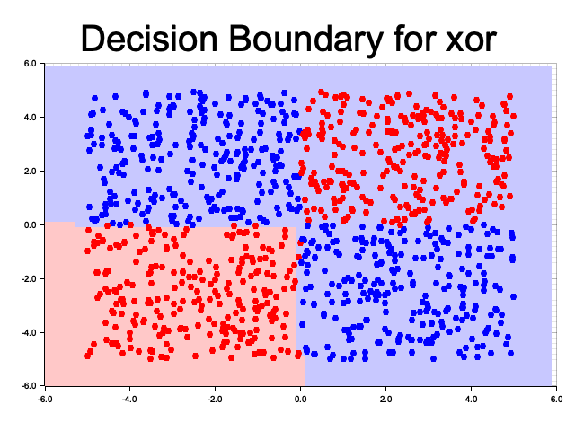
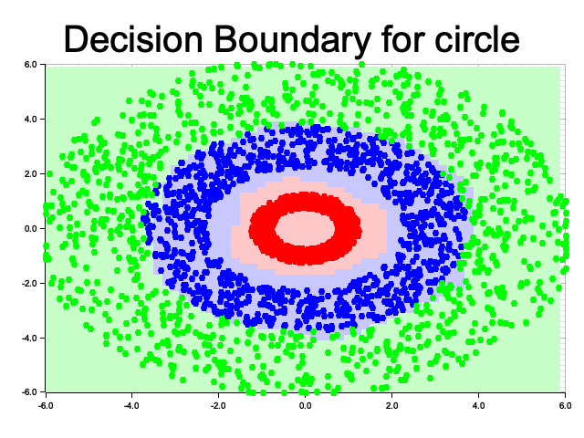
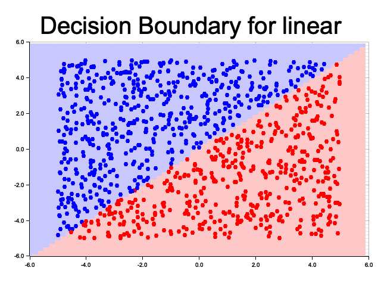
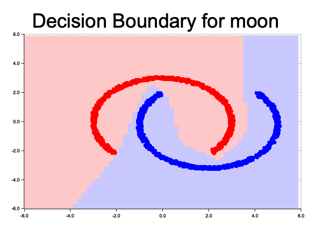
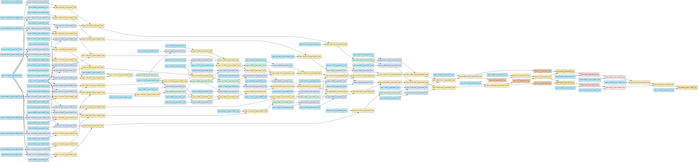

# `grad-rs`: A minimal autograd engine
`grad-rs` is an implementation of a minimal automatic differentiation engine (autograd) library for scalar values. `grad-rs` supports arithmetic operations, activation functions (softmax and ReLU), and the API and components are designed in the style of the PyTorch API. `grad-rs` provides basic versions of common PyTorch abstractions, such as a `Module` abstraction for the neural network, `DataLoader`, an `Optimizer` (SGD), and a loss function. 

This library is used to create a simple neural network applied to various canonical multiclass classification problems (linear, XOR, half moons, concentric circles) to illustrate its functionality. The library can also be applied to other multiclass classification and regression tasks with different dimensions.

`grad-rs` creates a computation graph (a DAG of nodes in the forward pass) where each node is a model parameter or an intermediate value. This is analogous to a PyTorch tensor, however gradients are stored for all nodes, not only leaf nodes. In contrast, for memory efficient, PyTorch only stores gradients for leaf nodes which require gradients. More relevant info is in PyTorch docs for [`is_leaf`](https://pytorch.org/docs/stable/generated/torch.Tensor.is_leaf.html). This is used in the backwards pass with prewritten gradient functions to compute the derivative of the loss wrt each node. A small set of arithmetic and the resulting computation graph can be composed to compute derivatives of relatively complex functions (e.g. softmax which transforms a vector into a vector). Inspiration was taken from [Karpathy's micrograd](https://github.com/karpathy/micrograd) in Python. Useful for educational purposes.

## Usage
Clone the repository and run via
```sh
# View configurable hyperparameters and data sets
cargo run -- -h
# Train on a classification task with default training parameters
cargo run
```

## Example Results
Below are examples of classification outputs on select classification tasks. Each used the default configuration for a neural network with a single 10 neuron hidden layer (trained across 50 epochs, 0.001 learning rate, 0.9 momentum, minibatch size of 50 elements). 

### XOR
XOR used `0.005` learning rate. On occassion, fitting XOR can be stuck in a local optimum if the initial decision boundary only covers one of the quadrants (see `xor_suboptimal.png`).


### Concentric Circles


### Linear


### Moons


## Graphviz Output
`grad-rs` also optionally outputs a graphviz `.dot` file to visualize the neural network gradients and weights which is useful for gaining intuition and debugging. Since this graph can be unweildy for larger networks than the default network size, it is off by default and can be toggled by CLI args and output with a command like:
```sh
cargo run -- --graphviz
dot -Tpng output/weights_epoch_1_xor.dot -o output/weights_epoch_1_xor.png
```

For example, the image below could help debug an issue (you may need to view the original in the `output` folder if the below is small). The image is a snapshot of a neural network with a single 10 node hidden layer after the first forward and backward pass. Before delving into the issue with this network, you can first analyze the graph structure. You can see the components of the neural network you would expect in the color coded boxes:
- 10 green ReLU nodes correspond to the activation functions of the 10 hidden nodes
- On the right, orange nodes (`exp`) represent the softmax numerator and denominator
- The far right pink nodes represent the MSE (`add`, `div`, `pow`), averaged over the probability output of the two classes 
- The far left side of the diagram is more involved, but corresponds to the network input and weights to the hidden layer. You can see many blue nodes labeled "leaf". Those which only have one output edge to a `Mul` block correspond to either a weight or a bias. There are two which have multiple output edge (10 in this case) correspond to the (x, y) inputs for the data point which are each multiplied by 10 (different) incoming weights to the hidden layer
- The center holds weights from the hidden layer to the output layer and has similar structure to the first layer on the far left. However here we are mapping 10 neurons to 2, so the graph height collapses.



The problem with this network is it has an intentionally poor weight initialization (randomly sampled uniformly between 0 and 100). You can see this in the leaf nodes on the left (corresponding to weights) which indeed have `data` values averaging ~50. Typically, we want weight values with absolute value less than 1 and centered at zero! This weight initialization would make the output of the network explode in magnitude, which makes the softmax numerator and denominator extremely large and round to `inf`. When the softmax is taken, `inf / inf = NaN` is calculated, and `NaN` will propagate in any arithmetic. So after a few iterations of the forward pass and backward propagation, all nodes will be `f32::NaN` and the network will not learn! To solve this problem the real `grad-rs` `Neuron` uses [He initialization](https://arxiv.org/abs/1502.01852) which has shown to work well for ReLU based networks and keeps the total variance of input and output nodes constant.  


