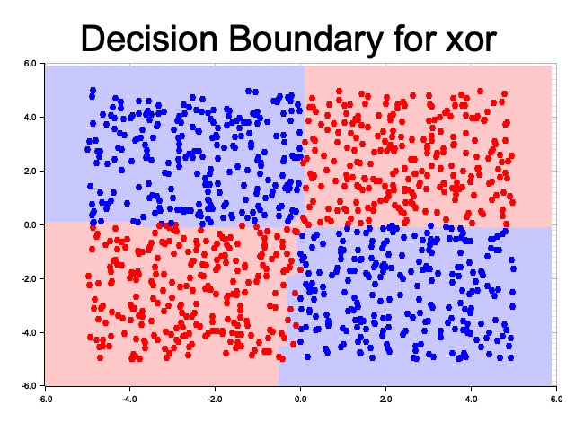

# `grad-rs`: A minimal autograd engine
`grad-rs` is an implementation of a minimal automatic differentiation engine (autograd) library for scalar values. `grad-rs` supports arithmetic operations, activation functions (softmax and ReLU), and the API and components are designed in the style of the PyTorch API. `grad-rs` provides basic versions of common PyTorch abstractions, such as a `Module` abstraction for the neural network, `DataLoader`, an `Optimizer` (SGD), and a loss function. 

This library is used to create a simple neural network applied to various canonical binary classification problems (linear, XOR, half moons, concentric circles) to illustrate its functionality. The library can also be applied to other multiclass classification and regression tasks with different dimensions.

`grad-rs` creates a computation graph (a DAG of nodes in the forward pass) where each node is a model parameter or an intermediate value (analogous to a PyTorch tensor, however gradients are computed for all nodes not only leaf nodes). This is used in the backwards pass with prewritten gradient functions to compute the derivative of the loss wrt each node. A small set of arithmetic and the resulting computation graph can be composed to compute derivatives of relatively complex functions (e.g. softmax which transforms a vector into a vector). Inspiration was taken from [Karpathy's micrograd](https://github.com/karpathy/micrograd) in Python. Useful for educational purposes.

## Usage
Clone the repository and run via
```sh
# View configurable hyperparameters and data sets
cargo -h
# Train on a classification task with default training parameters
cargo run
```

## Example Results
Below are examples of classification outputs on select binary classification tasks. Each used the default configuration for a neural network with a single 10 neuron hidden layer (trained across 50 epochs, 0.001 learning rate, 0.9 momentum, minibatch size of 50 elements).

### XOR


### Concentric Circles


### Linear


### Moons

